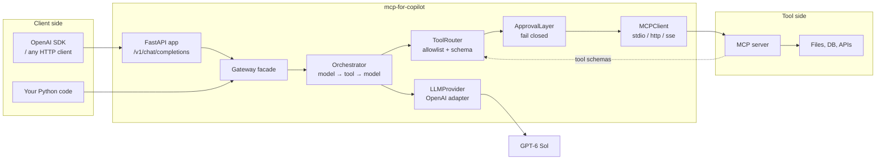

<div align="center">

# 🛰️ MCP for Copilot

**Give Copilot hands.**

A production-ready [Model Context Protocol](https://modelcontextprotocol.io) gateway.
Use it as a **Python library** or deploy it as an **OpenAI-compatible FastAPI service**.

[](https://github.com/rwamyth-blip/mcp-for-copilot/actions/workflows/ci.yml)
[](https://github.com/rwamyth-blip/mcp-for-copilot/actions/workflows/codeql.yml)
[](https://pypi.org/project/mcp-for-copilot/)
[](https://pypi.org/project/mcp-for-copilot/)
[](https://opensource.org/licenses/MIT)
[](#-testing)
[](https://github.com/astral-sh/ruff)
[](https://github.com/rwamyth-blip/mcp-for-copilot/pkgs/container/mcp-for-copilot)

[Quick Start](#-quick-start) · [Installation](#-installation) · [Examples](#-usage-examples) · [Architecture](#️-architecture) · [Docs](https://rwamyth-blip.github.io/mcp-for-copilot/) · [Contributing](#-contributing)

</div>

---

## 🎯 What is this?

Copilot is a strong reasoning assistant, but on its own it cannot read your files,
query your database, or run your tools. **MCP for Copilot** connects it to
any [MCP server](https://modelcontextprotocol.io) and puts three safety gates in
front of every tool call: an **allowlist**, an **approval layer**, and
**argument validation**.

It speaks two protocols at once — MCP on the tool side, OpenAI on the client
side — so any OpenAI SDK client can use it as a drop-in replacement, and any MCP
server can be its tool provider.

---

## ✨ Features

- 🔌 **Three MCP transports** — `stdio`, `http` (streamable), and `sse`
- 🧠 **GPT-6 family aware** — Sol, Luna, Astra, and GPT-5.6 Sol/Luna with correct
  context windows, output caps, and pricing metadata
- 🛡️ **Three-gate tool safety** — allowlist → approval → dispatch, and it
  **fails closed** at every gate
- ✅ **Argument validation** — JSON-schema subset validation before dispatch, so
  a malformed call never reaches your server
- 🚦 **Risky-tool detection** — 40+ mutating verbs (`write`, `delete`, `exec`, …)
  are flagged automatically; unknown tools are treated as risky
- 🔐 **Secret redaction** — 11 regex rules scrub keys, tokens, and JWTs from
  every log line and error message
- 🧯 **Prompt-injection guard** — tool output is wrapped and labelled as
  untrusted data before it re-enters the model context
- 🌊 **Streaming** — OpenAI-compatible SSE with the exact chunk format clients expect
- 🐳 **Multi-stage Docker** — one image, both modes, non-root user, healthcheck
- 🧩 **Zero-config library mode** — `pip install` and go; no server required
- 🧪 **Typed and tested** — full type hints, `mypy --strict`, 3-layer test suite

---

## 🚀 Quick Start

### Option A — Use as a library

```bash
pip install "mcp-for-copilot[library]"
```

```python
import asyncio
from mcp_for_copilot import Gateway

async def main():
    async with Gateway() as gateway:
        result = await gateway.chat([
            {"role": "user", "content": "List the files in the current directory."}
        ])
        print(result.content)
        print("tools used:", result.used_tools)

asyncio.run(main())
```

### Option B — Deploy as a server

```bash
pip install "mcp-for-copilot[server]"
export LLM_API_KEY=sk-...
mcp-for-copilot serve
```

```bash
curl http://localhost:8000/v1/chat/completions \
  -H "Content-Type: application/json" \
  -d '{"model": "gpt-6-sol", "messages": [{"role": "user", "content": "Hello!"}]}'
```

That is the whole setup. Any OpenAI SDK client works against it unchanged.

---

## 📦 Installation

### pip

```bash
# Library only — talk to an MCP server from your own code
pip install "mcp-for-copilot[library]"

# Server — FastAPI gateway + stdio MCP server
pip install "mcp-for-copilot[server]"

# Everything
pip install "mcp-for-copilot[all]"
```

### Docker

```bash
docker run --rm -p 8000:8000 \
  -e LLM_API_KEY=sk-... \
  ghcr.io/rwamyth-blip/mcp-for-copilot:latest
```

### From source

```bash
git clone https://github.com/rwamyth-blip/mcp-for-copilot.git
cd mcp-for-copilot
pip install -e ".[all,dev]"
cp .env.example .env   # then edit .env
```

---

## 💡 Usage Examples

### 1. Library — chat with tools, with an audit trail

```python
import asyncio
from mcp_for_copilot import Gateway

async def main():
    async with Gateway() as gateway:
        result = await gateway.chat(
            [{"role": "user", "content": "How many documents are in the users collection?"}],
            system="You are a helpful data assistant.",
        )

        print(result.content)
        for call in result.invocations:
            status = "ok" if call["executed"] and not call["is_error"] else "blocked"
            print(f"  [{status}] {call['tool']} — {call['reason']}")

asyncio.run(main())
```

### 2. Server — OpenAI SDK, unchanged

```python
from openai import OpenAI

client = OpenAI(base_url="http://localhost:8000/v1", api_key="not-needed-locally")

response = client.chat.completions.create(
    model="sol",  # alias for gpt-6-sol
    messages=[{"role": "user", "content": "Summarise README.md"}],
)
print(response.choices[0].message.content)
```

### 3. Custom approval policy — approve only what you trust

```python
import asyncio
from mcp_for_copilot import Gateway, static_approver

async def main():
    approver = static_approver(allow=["write_file"], deny=["delete_file"])
    async with Gateway(approver=approver) as gateway:
        result = await gateway.chat([
            {"role": "user", "content": "Write 'hello' to notes.txt"}
        ])
        print(result.content)

asyncio.run(main())
```

### 4. CLI — one-shot prompt

```bash
mcp-for-copilot chat "What models do you support?" --json
mcp-for-copilot models
mcp-for-copilot status
```

---

## 🏗️ Architecture



### The three gates

Every tool call the model requests must pass all three, in order:

| Gate | Component | Behaviour on failure |
|------|-----------|----------------------|
| 1. Allowlist | `ToolRouter.route()` | Denied — reported to the model as an error result |
| 2. Approval | `ApprovalLayer.request()` | Denied — **fails closed** when no approver is configured |
| 3. Dispatch | `MCPClient.call_tool()` | Error captured and returned; the turn continues |

A denied tool never aborts the turn. The model is told *why* it was denied and
can explain the outcome or try a different approach.

### Why `reasoning_effort` is forced to `none` with tools

The GPT-6 family rejects function tools combined with `reasoning_effort` on
`/v1/chat/completions`:

> Function tools with reasoning_effort are not supported for gpt-6-luna in
> /v1/chat/completions. To use function tools, use /v1/responses or set
> reasoning_effort to 'none'.

The field must be **present and set to `"none"`** — omitting it is also
rejected. Since tool calling is the entire point of this package, the provider
adapter sends `"none"` whenever tools are present, and forwards your configured
effort unchanged when they are not.

---

## ⚙️ Configuration

All configuration is environment-driven. See [`.env.example`](.env.example) for
the annotated list.

| Variable | Default | Description |
|----------|---------|-------------|
| `LLM_API_KEY` | *(empty)* | **Required.** Provider API key. |
| `LLM_MODEL_ID` | `gpt-6-sol` | Model id or alias. |
| `LLM_BASE_URL` | `https://api.openai.com/v1` | OpenAI-compatible base URL. |
| `LLM_REASONING_EFFORT` | *(empty)* | `none`/`low`/`medium`/`high`/`xhigh`/`max`. |
| `MCP_SERVER_URL` | *(empty)* | Command (stdio) or URL (http/sse). |
| `MCP_TRANSPORT` | `stdio` | `stdio`, `http`, or `sse`. |
| `MCP_REQUIRE_APPROVAL` | `true` | Require approval for risky tools. |
| `MCP_ALLOWED_TOOLS` | *(empty)* | Comma-separated allowlist; empty = read-only defaults. |
| `MCP_MAX_TOOL_ROUNDS` | `5` | Cap on model → tool → model rounds. |
| `GATEWAY_API_KEY` | *(empty)* | When set, `/v1/*` requires `Authorization: Bearer`. |
| `GATEWAY_PORT` | `8000` | Bind port. |

### Supported models

| Model | Tier | Context | Max output | Input / Output per Mtok |
|-------|------|---------|------------|-------------------------|
| `gpt-6-astra` | flagship | 1.05M | 128K | $10 / $50 |
| `gpt-6-sol` | balanced | 1.05M | 128K | $2 / $10 |
| `gpt-6-luna` | efficient | 1.05M | 128K | $0.10 / $0.50 |
| `gpt-5.6-sol` | flagship | 1.05M | 128K | $4 / $20 |
| `gpt-5.6-luna` | efficient | 1.05M | 128K | $0.20 / $1.20 |

Aliases: `gpt-6`, `gpt6`, `sol` → `gpt-6-sol` · `luna` → `gpt-6-luna` ·
`astra` → `gpt-6-astra` · `gpt-5.6` → `gpt-5.6-sol`

---

## 🐳 Docker

```bash
# Gateway mode (default)
docker compose up gateway

# stdio MCP server mode
docker compose up mcp

# Both
docker compose up
```

The image is multi-stage: dependencies are built in a builder stage, and the
runtime stage runs as a non-root user with a `HEALTHCHECK` on `/health`.

---

## 🧪 Testing

```bash
make test          # pytest with coverage
make lint          # ruff check + format check
make typecheck     # mypy --strict
make check         # all of the above
```

Tests are split into three layers:

| Layer | Path | What it covers |
|-------|------|----------------|
| Unit | `tests/unit/` | `provider`, `mcp_client`, `tool_router`, `approval`, `config` |
| Integration | `tests/integration/` | `gateway.app` routes, `gateway.server` tools |
| End-to-end | `tests/e2e/` | Full model → tool → model loop with a fake MCP server |

No test touches the network: `httpx` transports and the MCP client are injected.

---

## 📚 Documentation

Full documentation lives at
**[rwamyth-blip.github.io/mcp-for-copilot](https://rwamyth-blip.github.io/mcp-for-copilot/)**.

- [Getting started](docs/getting-started.md)
- [Library guide](docs/guides/library.md)
- [Server guide](docs/guides/server.md)
- [Security model](docs/guides/security.md)
- [API reference](docs/api.md)

---

## 🤝 Contributing

Contributions are welcome. Please read [CONTRIBUTING.md](CONTRIBUTING.md) and
[CODE_OF_CONDUCT.md](CODE_OF_CONDUCT.md) first.

```bash
git clone https://github.com/rwamyth-blip/mcp-for-copilot.git
cd mcp-for-copilot
pip install -e ".[all,dev]"
pre-commit install
make check
```

Good first issues are labelled
[`good first issue`](https://github.com/rwamyth-blip/mcp-for-copilot/labels/good%20first%20issue).

---

## 🔐 Security

Please **do not** open a public issue for a vulnerability. See
[SECURITY.md](SECURITY.md) for the private disclosure process.

This package never logs a credential: every log line and error message passes
through `mcp_for_copilot.logging_utils.redact()`.

---

## 📄 License

[MIT](LICENSE) © VihokAI

---

## ⭐ Star History

<a href="https://star-history.com/#rwamyth-blip/mcp-for-copilot&Date">
  <picture>
    <source media="(prefers-color-scheme: dark)" srcset="https://api.star-history.com/svg?repos=rwamyth-blip/mcp-for-copilot&type=Date&theme=dark" />
    <source media="(prefers-color-scheme: light)" srcset="https://api.star-history.com/svg?repos=rwamyth-blip/mcp-for-copilot&type=Date" />
    
  </picture>
</a>

<div align="center">

**[⬆ back to top](#️-gpt-6-sol-mcp-gateway)**

</div>
