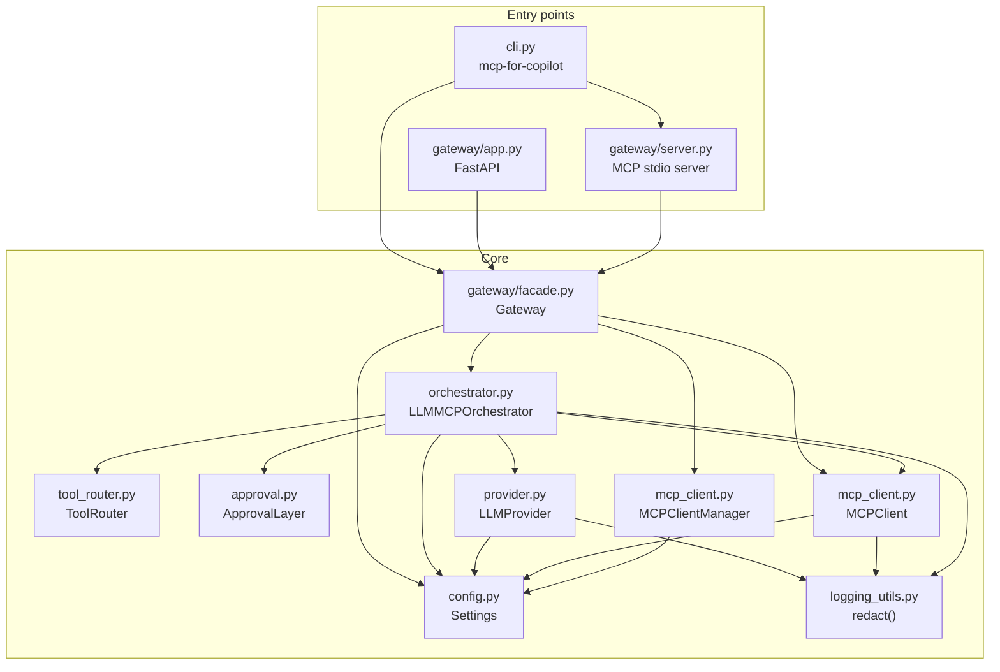
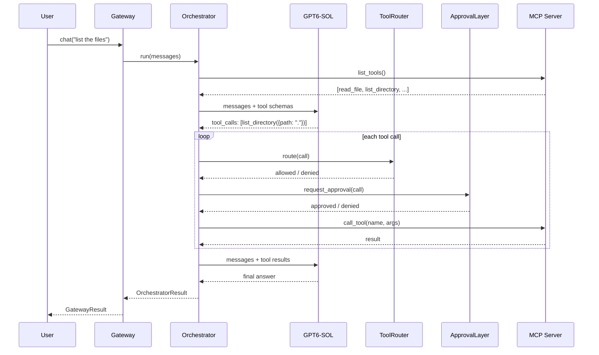

# Architecture

## Component map

`Gateway` holds either an `MCPClient` (single server, from `MCP_SERVER_URL`) or an `MCPClientManager`
(many servers, from `MCP_SERVERS`). The manager fans out `list_tools()` and `call_tool()` across every
connected server and drops servers that fail to connect at startup.

## Request lifecycle

## The three gates

Every tool call must pass all three gates before it reaches the MCP server.

### Gate 1 — Allowlist

`ToolRouter` only permits tools that are **both** named in the allowlist **and** advertised by the
connected MCP server. A tool that is allowlisted by name but never advertised is denied, because the
gateway cannot validate its arguments without a schema.

### Gate 2 — Risk classification

`is_risky_tool()` matches the tool name against 40 destructive verbs (`delete`, `drop`, `write`,
`execute`, `deploy`, `truncate`, …) plus an explicit risky set (`codex_run`, `mongo_aggregate`) and an
explicit safe set that overrides the pattern match.

Arguments are validated against the tool's JSON schema before execution: required keys present, types
match, no unexpected keys.

### Gate 3 — Approval

`ApprovalLayer` is **fail-closed**. It denies when:

- no approver is configured,
- the approver raises an exception,
- the approver returns something that is not an `ApprovalDecision`.

A denial is returned to the model as a tool error, so the model can explain the refusal instead of the
request crashing.

## Provider quirk handling

The GPT-6 family rejects `reasoning_effort` combined with function tools on `/v1/chat/completions`.
The gateway detects the presence of `tools` and forces `reasoning_effort = "none"` on the request body.
The field must be **present and equal to `"none"`** — omitting it is also rejected.

## Error propagation

`LLMProviderError` is never raised out of `LLMMCPOrchestrator.run()`. Instead it is recorded in
`OrchestratorResult.error`, which `Gateway` copies into `GatewayResult.error`. The HTTP layer then
decides the status code — `502 Bad Gateway` for provider failures, `400` for bad input. This keeps the
library usable without an HTTP context while still letting the server return correct status codes.

## Streaming

Streaming is **not** incremental at the provider level. The orchestrator produces the complete answer
(including any tool round-trips), then `_stream()` chunks it at 220 characters to match OpenAI's
server-sent-event wire format. This keeps tool calling and streaming compatible, at the cost of
time-to-first-token.

## Module responsibilities

| Module | Responsibility |
| --- | --- |
| `config.py` | Environment loading, validation, `Settings.describe()` |
| `logging_utils.py` | Secret redaction, structured log helpers |
| `provider.py` | Model catalogue, aliases, OpenAI client wrapper |
| `mcp_client.py` | MCP transports, tool discovery, tool invocation |
| `tool_router.py` | Allowlist, risk classification, argument validation |
| `approval.py` | Human-in-the-loop gate, fail-closed |
| `orchestrator.py` | The bounded tool-calling loop |
| `gateway/facade.py` | Lifecycle owner, ergonomic `chat()` |
| `gateway/app.py` | OpenAI-compatible HTTP surface |
| `gateway/server.py` | MCP stdio server exposing the gateway |
| `cli.py` | `serve`, `mcp`, `chat`, `models`, `status` |
