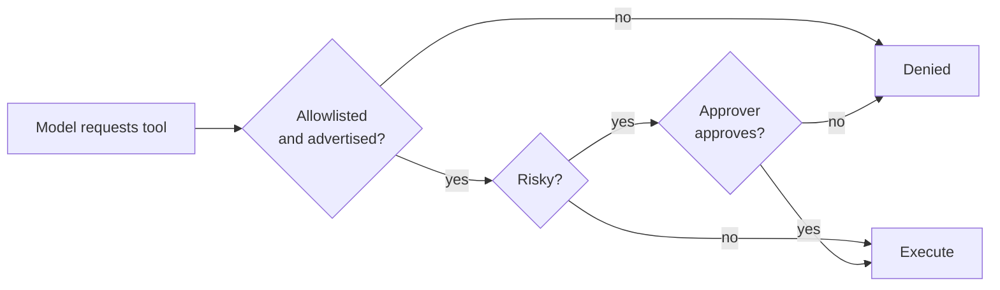

# Security

## Threat model

The gateway sits between an LLM and tools that can change the world. The realistic threats are:

| Threat | Mitigation |
| --- | --- |
| **Prompt injection** makes the model call a destructive tool | Three-gate pipeline; risky tools require explicit approval |
| **Credential leakage** through logs | 11-rule redactor applied to every log record |
| **Argument injection** into a tool | JSON-schema validation before execution |
| **Unbounded cost** from a tool-calling loop | `MCP_MAX_TOOL_ROUNDS` caps the loop |
| **Unauthorised API access** to the gateway | Optional `GATEWAY_API_KEY` bearer check |
| **Supply-chain compromise** | CodeQL scanning, pinned actions, minimal runtime image |

## The three gates

### Fail-closed approval

`ApprovalLayer` denies when:

- no approver is configured,
- the approver raises an exception,
- the approver returns a value that is not an `ApprovalDecision`.

There is no code path where an error in your approver grants access.

### Denied calls are not crashes

A denial is returned to the model as a tool error. The model can then explain the refusal in its final
answer, which is far more useful than a 500 response.

## Secret redaction

`logging_utils.redact()` applies 11 regex rules covering:

- OpenAI-style keys (`sk-…`)
- Bearer tokens
- JWTs
- AWS access key ids and secret keys
- Google API keys
- Slack tokens
- GitHub tokens
- Generic `password=` / `token=` / `secret=` assignments
- Connection strings with embedded credentials
- Private key headers
- Long high-entropy hex strings

Every log helper (`log_info`, `log_warning`, `log_error`, `log_debug`, `safe_log`) routes through it.
`redact_mapping()` does the same for dictionaries, so structured logs are covered too.

!!! note "Redaction is defence in depth, not a licence"
    Do not log secrets on purpose and rely on the redactor. Treat it as a safety net for accidental
    leakage.

## Hardening checklist

- [ ] `LLM_API_KEY` and `MCP_AUTH_TOKEN` come from a secret manager, never from a committed file
- [ ] `.env` is gitignored (it is, by default)
- [ ] `MCP_ALLOWED_TOOLS` lists only what the workload genuinely needs
- [ ] Risky tools are either absent from the allowlist or gated by a real approver
- [ ] `MCP_MAX_TOOL_ROUNDS` is low (3–5) to bound cost and blast radius
- [ ] `GATEWAY_API_KEY` is set whenever the server is reachable beyond localhost
- [ ] `GATEWAY_CORS_ORIGINS` is narrowed from `*` in production
- [ ] The container runs as the non-root uid `10001` (it does, by default)
- [ ] Logs are shipped to a collector with its own access control
- [ ] TLS terminates at a proxy in front of the gateway

## Reporting a vulnerability

Please **do not** open a public issue for security problems. See
[SECURITY.md](https://github.com/rwamyth-blip/mcp-for-copilot/blob/main/SECURITY.md) for the
private reporting process.

## Supported versions

| Version | Supported |
| --- | --- |
| 0.1.x | ✅ |
